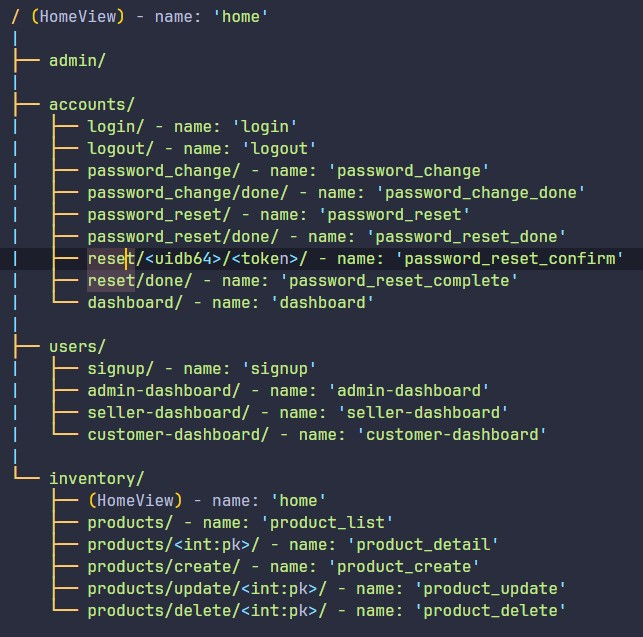

# LOGSIS
Un sistema de login o acceso a usuarios con funcionalidades de inventario.

## Descripción
LOGSIS es un sistema de login o acceso a usuarios construido con Django 4.2.13. Utiliza [TailwindCSS](https://tailwindcss.com/) para los estilos CSS, Gulp para tareas de automatización y un poco de JavaScript para los efectos de las alertas. Además, incluye un sistema de inventario básico.

## Tabla de Contenidos
1. [Descripción](#descripción)
2. [Instalación](#instalación)
3. [Estructura del Proyecto](#estructura-del-proyecto)
4. [Características](#características)
5. [Mapa de URLs](#mapa-de-urls)

## Instalación
Sigue estos pasos para instalar y configurar el proyecto:

1. Crea un entorno virtual:
   ```bash
   python3.11 -m venv venv

2. Clona el repositorio:
git clone https://github.com/rcarlosalba/LogSis.git
cd LogSis

3. Instala las dependencias: 
pip install -r requirements.txt

4. Configura las variables de entorno en un archivo .env en la raíz del proyecto:

SECRET_KEY=your_secret_key
DEBUG=True
EMAIL_HOST_USER=your_mailtrap_username
EMAIL_HOST_PASSWORD=your_mailtrap_password

5. Ejecuta las migraciones de la base de datos:
python manage.py migrate

6. Inicia el servidor de desarrollo:
python manage.py runserver

## Estructura del Proyecto
El proyecto está organizado en varias aplicaciones Django, cada una con un propósito específico:

- core: Aplicación principal que maneja la configuración del proyecto y la vista de inicio.
- accounts: Gestiona la autenticación de usuarios, incluyendo login, logout, cambio de contraseña y restablecimiento de contraseña.
- users: Maneja el registro de usuarios y los dashboards específicos para diferentes tipos de usuarios (admin, vendedor, cliente).
- inventory: Gestiona el sistema de inventario, incluyendo la creación, visualización, actualización y eliminación de productos.

## Características
- Django: Sistema de login con acceso a un dashboard.
- TailwindCSS: Estilos procesados por medio de Gulp.
- Gulp: Automatización de tareas.
- JavaScript: Efectos de alertas.
- Mailtrap: Configuración para enviar correos electrónicos de recuperación de contraseña.
- Sistema de Inventario: Gestión básica de productos con operaciones CRUD.

## Mapa de URLs


## Licencia
Este proyecto está licenciado bajo la [MIT License](https://opensource.org/license/mit).